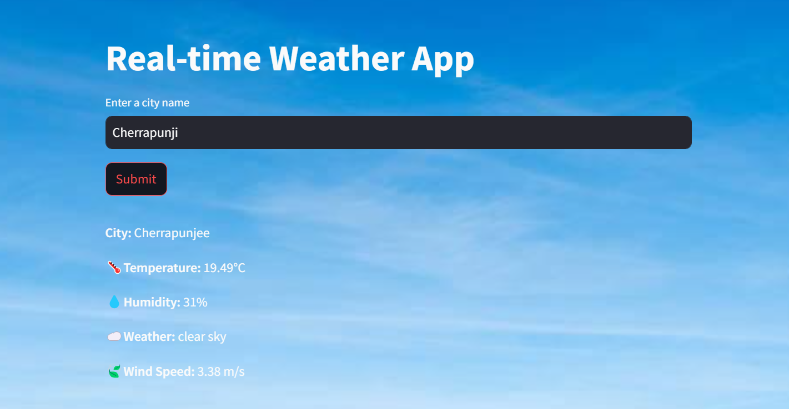
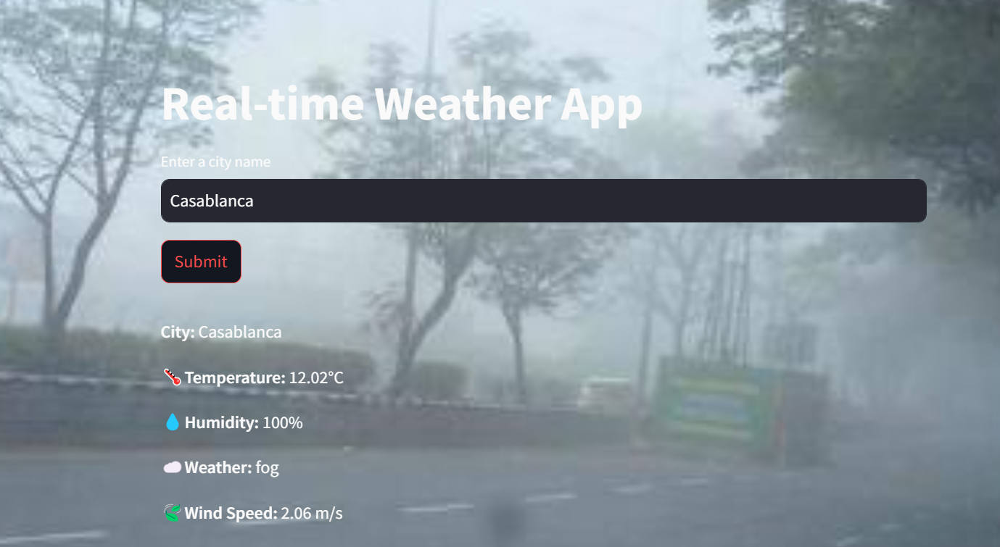
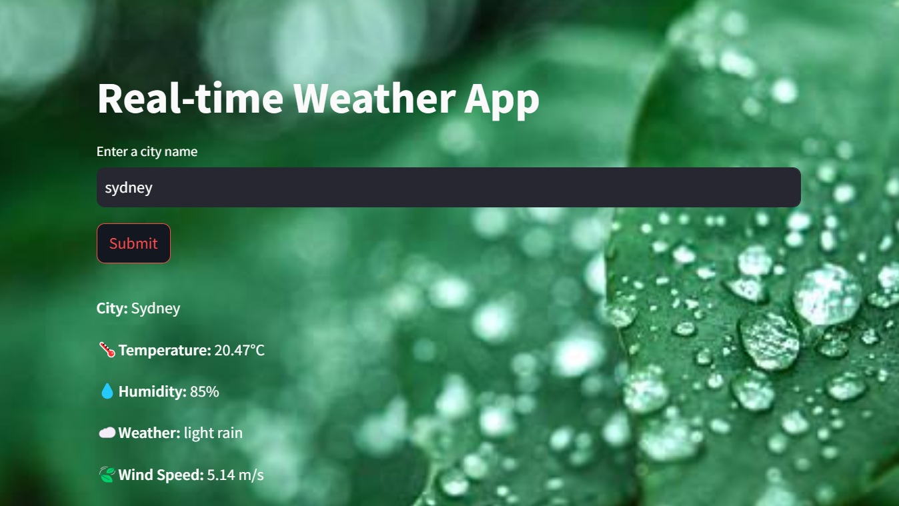
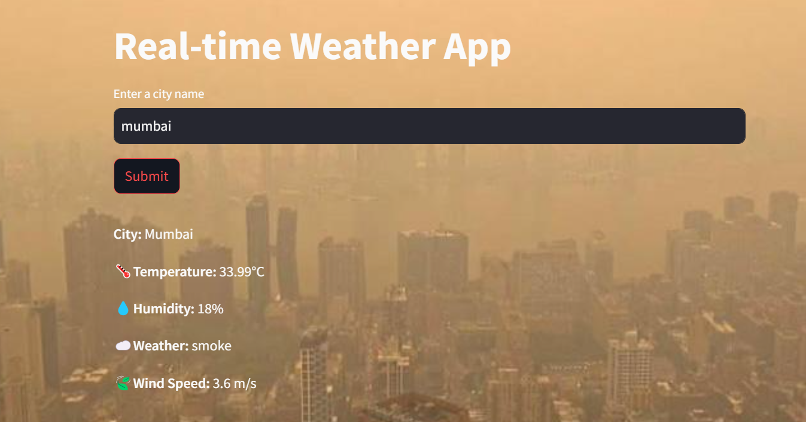

# Weather App

## Overview
The **Weather App** is a real-time weather application that fetches weather data from the OpenWeatherMap API and presents it in a user-friendly interface using **Streamlit**. The app allows users to search for weather details of any city and provides information such as temperature, humidity, weather conditions, and wind speed.

The app also dynamically changes the background image based on the weather description (e.g., rain, clear sky, etc.), ensuring an interactive and visually engaging user experience.

## Features
- Real-time weather updates fetched from the OpenWeatherMap API.
- Dynamic background image based on the weather condition (e.g., clear sky, rain, haze).
- Customizable and clean user interface built with Streamlit.
- Displays weather details such as temperature, humidity, weather description, and wind speed.

## Tech Stack
- **Programming Language**: Python
- **Frontend**: Streamlit
- **Backend**: Python (Requests library for API calls)
- **API Provider**: OpenWeatherMap API
- **Libraries**:
  - PIL (Python Imaging Library) for image processing
  - base64 for image encoding
  - requests for making API calls
- **Version Control**: Git

## Screenshots
Here are some screenshots of the Weather App in action:
*Dynamic Background based on Weather*

*Clear Sky*
  
*Fog*
  
*lightrain*
   
*smoke*
   

## Installation

To run the Weather App, you need to have Python installed on your system. Then, follow the steps below to get started:

1. Clone the repository:
    ```bash
    git clone <repository_url>
    ```

2. Navigate to the project directory:
    ```bash
    cd weather_app
    ```

3. Create a virtual environment (optional but recommended):
    ```bash
    python -m venv venv
    ```

4. Activate the virtual environment:
    - For Windows:
      ```bash
      venv\Scripts\activate
      ```
    - For macOS/Linux:
      ```bash
      source venv/bin/activate
      ```

5. Install the required dependencies:
    ```bash
    pip install -r requirements.txt
    ```

6. Create an `.env` file to store your OpenWeatherMap API key:
    - Add the following line to your `.env` file:
      ```bash
      OPENWEATHER_API_KEY=<your_api_key>
      ```
    - You can get the API key from [OpenWeatherMap](https://openweathermap.org/).

## Usage

1. To run the application, use the following command:
    ```bash
    streamlit run app.py
    ```

2. The application will open in your default web browser. In the app, you can enter the name of a city, and the app will fetch and display real-time weather details such as:
    - Temperature
    - Humidity
    - Weather condition (e.g., Clear Sky, Haze, Rain)
    - Wind speed

3. The background image of the page will change based on the weather condition (e.g., a rainy image for rainy weather).

## GitHub Repository

You can find the full source code and additional details on the [GitHub repository](https://github.com/your-username/weather-app).

## Contributing

1. Fork the repository.
2. Create a new branch (`git checkout -b feature-branch`).
3. Make your changes and commit (`git commit -am 'Add feature'`).
4. Push to the branch (`git push origin feature-branch`).
5. Open a pull request.

## License

This project is licensed under the MIT License - see the [LICENSE](LICENSE) file for details.


